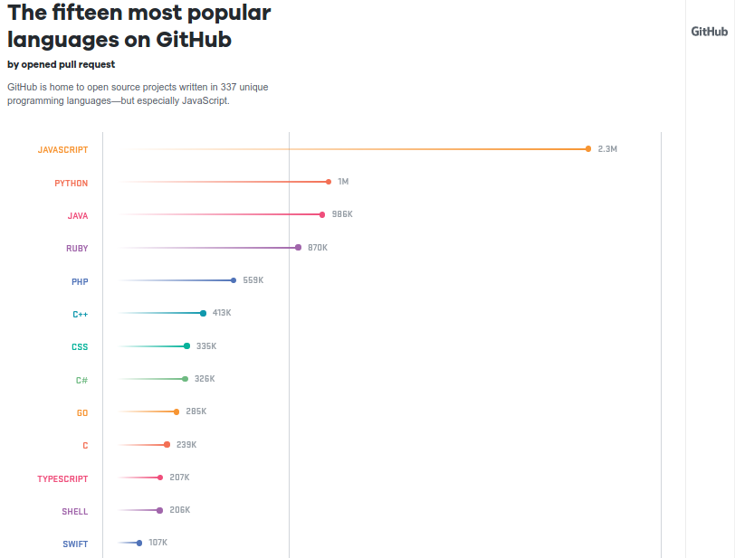

# Python Training Workshop 2018

## Table of Content
<!-- TOC -->

- [Python Training Workshop 2018](#python-training-workshop-2018)
    - [Table of Content](#table-of-content)
    - [Introduction](#introduction)
        - [Era of Computation](#era-of-computation)
        - [High-level language?](#high-level-language)
        - [Python as a versatile language](#python-as-a-versatile-language)
    - [Python Installation via Anaconda](#python-installation-via-anaconda)
    - [Packages](#packages)
        - [``conda`` : package management system for Anaconda](#conda--package-management-system-for-anaconda)
        - [``pip`` : a package management system in Python](#pip--a-package-management-system-in-python)
    - [Package Installation via setup files](#package-installation-via-setup-files)
    - [``virtualenv``](#virtualenv)
    - [Ipython / Jupyter Notebook](#ipython--jupyter-notebook)
    - [Text editors](#text-editors)
    - [Spyder](#spyder)
    - [Online Platforms](#online-platforms)
    - [Online Judge](#online-judge)
    - [Hand's on Session](#hands-on-session)
    - [Credits](#credits)

<!-- /TOC -->

## Introduction

> In 2017, Python replaced Java as the second-most popular language on GitHub, with 40 percent more pull requests opened this year than last. (Statistics from https://octoverse.github.com/)

Could that be a reason that you should learn Python?

### Era of Computation

### High-level language?
A list of programming languages ranging from very low to very high level:

* ``Machine Code`` could probably be considered the lowest level programming language.
* ``Assembly language`` is at the level of telling the processor what to do. There is still a conversion step towards machine code.
* ``C`` is a step up from assembler, because you get to specify what you want to do in slightly more abstract terms, but you're still fairly close to the metal.
* ``C++`` does everything that ``C`` can do but adds the capability to abstract things away into classes.
* ``Java/C#`` do similar things to ``C++`` in a way, but without the opportunity to do everything you can do in ``C``. They have garbage collection though, which you have to do manually in ``C++``.
* ``Python/Ruby`` are even higher level, and let you forget about a lot of the details that you would need to specify in something like ``Java`` or ``C#``.
* ``SQL`` is even higher level (it's declarative). Just say "Give me all the items in the table sorted by age" and it will work out the most efficient way to carry this out for you.

Quoted and simplified from:
https://stackoverflow.com/a/3468098

### Python as a versatile language
Python is a high-level language object-oriented programming language. 

Python has some advantages over other common languages:
- High-level programming language.
- Object-oriented, interpreted and interactive.
- Easily read and write.
- Dynamic variables and garbage memory management.

## Python Installation via Anaconda

Anaconda is a popular tool to install Python among data scientists. It
is 
Please refers to the following instructions:

- [Installing Python on Mac OS](installing-on-macos.md)
- [Installing Python on Microsoft Windows](installing-on-windows.md)
- [Installing Python on Linux](installing-on-linux.md)

## Packages

The term "package" refers to a distribution of a bundle of Python software. 
Don't mix this ''distribution'' up with a larger distribution of software as
with a Linux distribution or Anaconda. Installing Python Package is not difficult,
but you need to know the name of the package in advance.

### ``conda`` : package management system for Anaconda

### ``pip`` : a package management system in Python
The sources that ``pip`` installed can be 
- From PyPI (Python Package Index)
- From

Demonstrations on pip:

pip can install from either Source Distributions (sdist) or Wheels, but if both are present on PyPI, pip will prefer a compatible wheel.

## Package Installation via setup files

## ``virtualenv``
``virtualenv`` is a tool to create isolated Python environments

## Ipython / Jupyter Notebook
- [How to Start and Run a Jupyter Notebook](notebook.html)

## Text editors

## Spyder

## Online Platforms

## Online Judge

## Hand's on Session

## Credits
This tutorial have referenced the following materials:
- [Unidata's online-python-training](https://github.com/Unidata/online-python-training)
- [Anaconda Instllation Guide](https://conda.io/docs/user-guide/install/index.html)