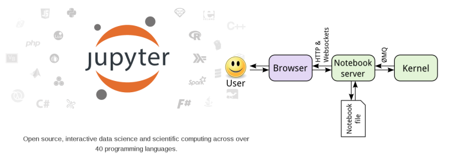
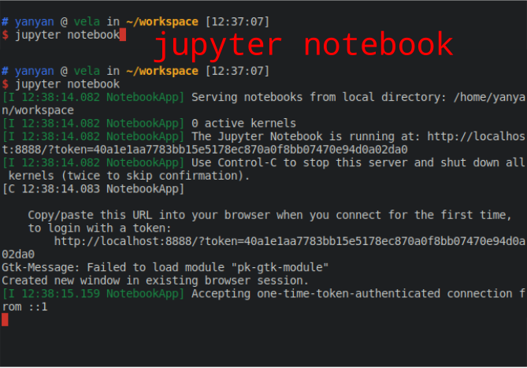

# Python Training Workshop 2019
## A brief introduction course to Python
### 31 Jan 2019
Ryan Leung 
(yanyan.ryan.leung@gmail.com)

Please go to http://goo.gl/ for the materials. :)

---
# Introduction

---
## Python: a very fast-growing language
<center>

</center>

---
## Era of Computation

* Open Source Codes everywhere
* Tons of packages
* Good documentations
* Multi-core CPU and GPU support
* Easily-accessible cloud framework

---
## Python: a versatile language
<center>
  

</center>

Python is a 

* high-level
* object-oriented, and 
* Interpreted

programming language.  

---
## Python: a "High-level language"

* "Low level language": C, Fortran, Basic
* **Level** means the accessiblity to system resources.
* **High Level** : 
  * care less about memory management or proper declaration of variables
  * less abstract than low-level language
  * less time to write and compile
  * relatively slower running time than some low-level language (not always true).

---
## Community of Python users
* Web backend developers
* Data science
* Machine learning

<center>

</center>
<sub>
Image courtesy of the Python Developers Survey 2017 Results website
</sub>

---
## Python 2 vs Python 3
Results are quoted from https://www.jetbrains.com/research/devecosystem-2018/python/

<center>

</center>

---
## Python Usages

<center>

</center>

---
# Installation
* Refer to another guide
* Recommendation:
  * Anaconda
  * Google colab
  
---
## Install packages (with anaconda)
* ```conda search xxxxxx```
* ```conda install xxxxxx```

---
## Install packages (with ``pip``)

``pip`` is a package management system in Python

To search/install packages:
* Search package : ```pip search xxxxxx```
* Install package : ```pip install xxxxxx```
* Upgrade package : ```pip install --upgrade xxxxxx```
* Uninstall package : ```pip uninstall xxxxxx```
* Install wheel package :``` pip install xxxxxx.whl```

# Jupyter Notebook
You may want to run a Jupyter notebook when:
* You want to try out a new experiment or analysis with an existing Jupyter notebook from someone.
* You want to develop an algorithm that run on a large software.
* You have only ten minutes to download a data, plot a graph and send the email to your supervisor in a neat format.



## Open Jupyter in Linux/MacOS
Type 
```bash
jupyter notebook
```


## Open Jupyter in Windows
Open your Start menu, goes to ``Anaconda`` Folder,
Click the ``Jupyter Notebook`` shortcut (Recommended). Or start the ``Anaconda Navigator`` and ``Launch``
